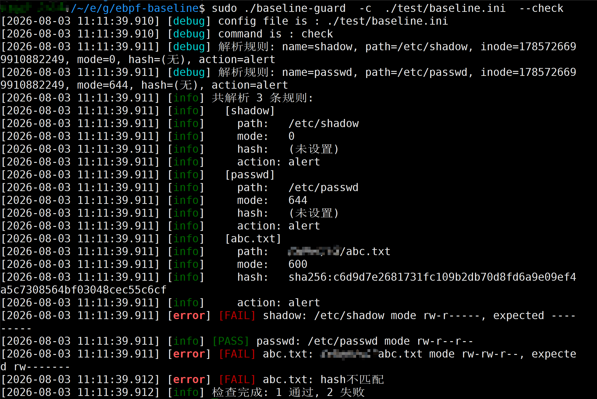
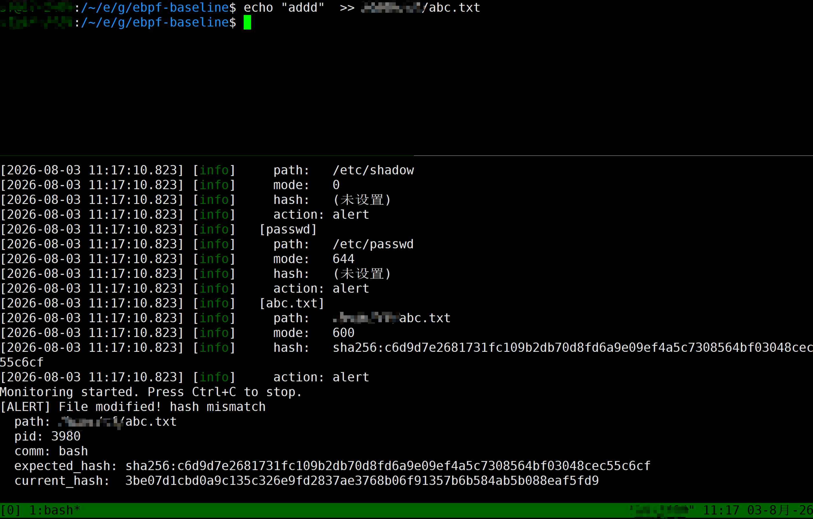

# baseline-guard: Linux File Integrity Monitor via eBPF LSM

[English](#english) | [中文](#chinese)

---

## English

Real-time, kernel-level file integrity monitoring for Linux. Event-driven, zero polling overhead.

### Why baseline-guard?

| Feature | AIDE | OSSEC | baseline-guard |
|---------|------|-------|----------------|
| Real-time | Scheduled scan | Polling | Event-driven |
| CPU / Disk | High during scan | Medium | &lt; 1% CPU, zero disk I/O |
| Deployment | Simple | Complex (agent+server) | Single binary, one command |
| Alert delay | Minutes to hours | Minutes | Sub-second |
| Kernel-level | No | No | Yes (eBPF LSM) |

### Quick Start

```bash
git clone https://github.com/xiaobaimao-linux/ebpf-baseline.git
cd ebpf-baseline
make
sudo ./baseline-guard check      # One-time baseline audit
sudo ./baseline-guard monitor    # Start real-time monitoring
```

### What it monitors (built-in)

- `/etc/passwd`, `/etc/shadow`, `/etc/group`
- `/etc/ssh/sshd_config`
- `/bin`, `/sbin`, `/usr/bin`, `/usr/sbin`
- Any path you define in `baseline.ini`

### Requirements

- Linux 5.7+ with `CONFIG_BPF_LSM=y`
- Clang/LLVM, libbpf
- gcc, make

### Screenshots




&gt; Place your screenshots in `docs/` directory.

### Use Cases

- Detect unauthorized changes to critical system files
- Replace heavy periodic scanners with lightweight real-time hooks
- Audit file permission drifts before they become incidents
- Complement host-based intrusion detection

### Commercial Support

Need help with deployment, custom rules, or eBPF development?

- **Remote deployment**: Get baseline-guard running on your servers
- **Custom rule sets**: Tailored monitoring for your environment
- **eBPF security consulting**: Custom kernel-level security tools

Contact: your-email@example.com

---

## 中文

基于 eBPF LSM 的 Linux 文件完整性实时监控工具。事件驱动，零轮询开销。

### 为什么用 baseline-guard？

| 特性 | AIDE | OSSEC | baseline-guard |
|------|------|-------|----------------|
| 实时性 | 定时扫描 | 轮询 | 事件触发 |
| CPU/磁盘开销 | 扫描时很高 | 中等 | CPU&lt;1%，零磁盘IO |
| 部署难度 | 简单 | 复杂（agent+server） | 单二进制，一行命令 |
| 告警延迟 | 分钟~小时 | 分钟级 | 秒级 |
| 内核级监控 | 不支持 | 不支持 | 支持（eBPF LSM） |

### 快速开始

```bash
git clone https://github.com/xiaobaimao-linux/ebpf-baseline.git
cd ebpf-baseline
make
sudo ./baseline-guard check      # 一次性基线核查
sudo ./baseline-guard monitor    # 启动实时监控
```

### 默认监控范围（开箱即用）

- `/etc/passwd`、`/etc/shadow`、`/etc/group`
- `/etc/ssh/sshd_config`
- `/bin`、`/sbin`、`/usr/bin`、`/usr/sbin`
- 支持通过 `baseline.ini` 自定义任意路径

### 系统要求

- Linux 5.7+，需开启 `CONFIG_BPF_LSM=y`
- Clang/LLVM、libbpf
- gcc、make

### 运行截图


&gt; 请将实际运行截图放在 `docs/` 目录下。

### 适用场景

- 关键系统文件被非法篡改的秒级发现
- 替代传统定时扫描工具，降低性能开销
- 文件权限漂移的常态化审计
- 主机层入侵检测的补充手段

### 技术支持

需要远程部署、自定义规则或 eBPF 安全工具定制？

- **远程部署服务**：在你的服务器上快速跑通 baseline-guard
- **自定义规则集**：针对你的业务环境定制监控策略
- **eBPF 安全咨询**：内核级安全工具定制开发

联系：xiaobaimao-linux@proton.me

---

## License

AGPL-3.0
