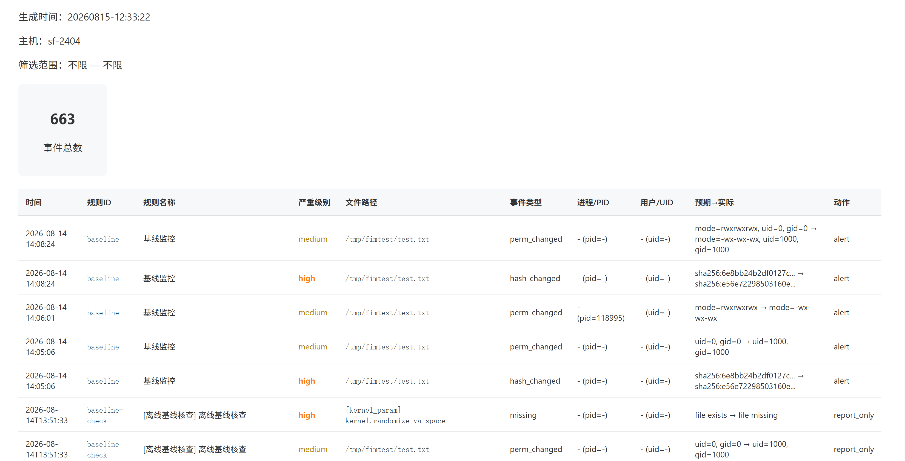

# baseline-guard
**基于 eBPF LSM 的 Linux 内核级文件完整性监控(FIM) & 安全基线核查工具**

适配等保2.0、服务器运维、工控、容器安全场景，区分两套独立工作模式：YAML规则事件监控 + SQLite持久化基线快照监控
------
## 一、项目简介
baseline-guard 依托eBPF LSM实现无侵入内核级文件审计，兼顾**静态基线快照比对**与**实时运行时篡改检测**，弥补传统静态扫描无法实时防护、通用监控工具无可信文件基准的短板。
核心能力拆分：
1. **基线快照管理**：递归采集目录/文件的SHA256哈希、UID/GID、权限存入SQLite，作为可信基准；配套离线全量核验、报表导出
2. **实时eBPF监控双模式**
   - 纯YAML模式：仅按配置文件规则捕获读写/删/改权限事件，产出yaml-rule告警
   - 基线监控模式（`--db`启用）：加载SQLite基线，启动自检+实时篡改校验，区分存量风险与运行时入侵
3. **多渠道告警降噪**：支持钉钉机器人推送，实时告警/基线核查告警独立冷却策略，避免消息轰炸
4. **合规交付输出**：离线核查HTML审计报表、全量告警历史查询、事件汇总报告
5. **低资源开销**：事件驱动而非高频轮询，默认关闭定时全库扫描，仅开机自检兜底存量篡改

适用用户：
- 需要满足等保2.0三级文件完整性审计要求的政企运维
- 工控/嵌入式Linux安全运维团队
- 安全服务商等保自查、合规取证交付
- 云服务器、容器集群基线常态化防护

------
## 二、核心功能总览
### 模块1：SQLite基线快照全生命周期管理（baseline 子命令组）
所有子命令默认读取内置默认SQLite库，支持`--db`自定义数据库路径，数据存储表：`baseline_entries`(基线记录)、`alerts`(告警持久化)
#### 1.1 baseline snapshot 采集可信基线
递归扫描文件/目录，写入当前文件哈希、权限、属主至基线库；重复执行自动更新条目，支持排除路径、自定义标签、关闭递归。
```bash
# 采集/etc目录基线，自定义标签，排除缓存目录
sudo ./baseline-guard baseline snapshot /etc --label release-202608 --exclude /etc/cache
# 仅扫描一级目录，不递归子文件夹
sudo ./baseline-guard baseline snapshot /tmp/fimtest --no-recurse
# 指定独立数据库存储基线
sudo ./baseline-guard baseline snapshot /tmp/fimtest --db /var/lib/baseline-guard/baseline.db
```
| 参数 | 说明 |
|------|------|
| PATH | 待采集文件/目录，支持多路径传入 |
| --db PATH | 指定SQLite基线库，不使用默认库 |
| --label NAME | 快照标签，默认default |
| --exclude PATH | 排除指定路径，可多次使用 |
| --no-recurse | 目录仅扫描直接子项，不递归深层文件 |

#### 1.2 baseline list 基线清单查询
分页查看库内全部基线条目，支持路径模糊过滤、JSON结构化导出。
```bash
# 过滤/tmp/fimtest下所有基线
sudo ./baseline-guard baseline list --path-filter "/tmp/fimtest/%"
# 分页查询，限制50条
sudo ./baseline-guard baseline list --limit 50 --offset 50
# 导出全量基线JSON
sudo ./baseline-guard baseline list --json > baseline_backup.json
```
| 参数 | 说明 |
|------|------|
| --db PATH | 指定目标数据库 |
| --path-filter PATTERN | SQL模糊匹配路径，%为通配符 |
| --limit N / --offset N | 分页控制 |
| --json | 输出标准JSON格式 |

#### 1.3 baseline delete 删除基线记录
仅删除数据库内对应条目，**不会删除磁盘真实文件**；目录支持递归匹配所有子文件基线。
```bash
# 删除单个文件基线
sudo ./baseline-guard baseline delete /tmp/fimtest/newfile.txt
# 递归删除/tmp/fimtest全部基线
sudo ./baseline-guard baseline delete /tmp/fimtest --recurse
```
| 参数 | 说明 |
|------|------|
| PATH | 文件/目录路径 |
| --recurse | 目录路径递归删除所有子文件基线 |
| --db PATH | 指定数据库 |

#### 1.4 baseline check 离线基线全量核查
读取基线库记录，与磁盘真实文件比对，识别4类风险；告警持久存入数据库，支持钉钉推送、HTML报表、JSON输出。
```bash
# 基础离线核查，控制台输出差异
sudo ./baseline-guard baseline check
# 检出篡改推送钉钉（必须携带配置文件）
sudo ./baseline-guard baseline check --send-webhook --config config.yaml
# 导出等保审计HTML报告
sudo ./baseline-guard baseline check --report_html baseline_report.html
# 仅校验指定目录基线
sudo ./baseline-guard baseline check --path-filter "/tmp/fimtest%"
```
| 参数 | 说明 |
|------|------|
| --db PATH | 指定基线数据库 |
| --path-filter PATTERN | 限定校验路径范围 |
| --send-webhook | 开启钉钉推送，依赖--config |
| -c/--config | 加载包含钉钉webhook的YAML配置 |
| --report_html FILE | 输出HTML合规报表 |
| --json | JSON结构化差异输出 |

比对风险类型：
| event_type | 等级 | 触发场景 |
|------------|------|----------|
| missing | high | 基线存在，磁盘文件已删除 |
| hash_changed | high | 文件SHA256哈希不一致，内容篡改 |
| perm_changed | medium | 文件UID/GID/权限发生变更 |
| access_failed | medium | 无权限读取文件，无法校验哈希 |

> 关键规则：仅校验库内存在的基线文件；不跟随软链接；磁盘属性与基线不一致即判定风险，重复执行chmod至违规值仍会告警。

#### 1.5 baseline clean 清理僵尸基线
自动清理磁盘已不存在、但库中残留的基线记录，支持预演不实际删除。
```bash
# 预演，仅打印待清理条目
sudo ./baseline-guard baseline clean --dry-run
# 执行清理
sudo ./baseline-guard baseline clean
```

### 模块2：monitor eBPF实时监控（双模式核心）
基于eBPF LSM捕获write/chmod/chown/unlink等文件操作，分为**纯YAML规则模式**、**基线监控模式**，完整参数适配最新迭代逻辑。
#### 两种运行模式区分
1. **纯YAML监控（无--db）**
```bash
sudo ./baseline-guard monitor -c config.yaml
```
- 仅读取配置中`file_rules`规则，匹配路径事件生成`yaml-rule`告警
- **不加载SQLite基线、不执行开机自检、无基线比对逻辑**
2. **基线监控模式（携带--db）**
```bash
# 默认：启动先执行全量基线自检，再进入实时监控
sudo ./baseline-guard monitor --db baseline.db -c config.yaml
# 跳过开机基线自检，直接进入实时监控
sudo ./baseline-guard monitor --db baseline.db -c config.yaml --skip-boot-baseline-check
# 开启可选兜底定时扫描（最小强制60s，默认关闭）
sudo ./baseline-guard monitor --db baseline.db -c config.yaml --baseline-scan-interval 300
```
新增专属参数说明：
| 参数 | 类型 | 默认 | 说明 |
|------|------|------|------|
| --skip-boot-baseline-check | 布尔标识 | 关闭 | 携带则跳过monitor启动一次性基线自检 |
| --baseline-scan-interval SEC | 整数 | 未启用 | 可选兜底周期全库扫描；输入＜60直接报错拦截；扫描告警归属baseline-check、独立冷却 |

#### 告警来源区分（统一存入alerts表）
1. `baseline-check`：monitor开机自检 / 定时兜底扫描 / 手动baseline check产出，独立5分钟冷却，避免刷屏
2. `baseline`：eBPF实时捕获文件操作后，比对基线发现篡改，1分钟告警降噪
3. `yaml-rule`：纯YAML规则匹配触发，沿用原有告警节流策略

> 架构优化点：移除默认10s高频轮询；默认仅开机一次自检兜底存量篡改，无后台持续扫描，大幅降低IO与CPU消耗。

### 模块3：告警管理与报表交付
#### 3.1 alerts 告警历史查询
读取SQLite持久化的全部告警记录，支持按规则、日期过滤。
```bash
# 查询最新20条告警
sudo ./baseline-guard alerts
# 仅查询基线实时篡改告警
sudo ./baseline-guard alerts --rule baseline
```

#### 3.2 report 事件汇总HTML报表
导出指定时间段全部告警记录，用于等保取证归档。
```bash
# 导出指定区间完整事件报表
sudo ./baseline-guard report --start 2026-08-01 --end 2026-08-15 -o full_audit.html
```

### 模块4：钉钉告警配置（config.yaml统一模板）
同一份配置文件同时兼容baseline check、monitor实时告警推送，二选一配置机器人安全策略：
```yaml
# config.yaml
dingtalk:
  webhook_url: "https://oapi.dingtalk.com/robot/send?access_token=xxx"
  # 生产环境启用签名校验
  secret: "SECxxxxxxx"

# 纯YAML监控模式所需文件规则（无基线模式生效）
file_rules:
  - path: "/tmp/fimtest/*"
    events: ["write", "delete", "chmod", "chown"]
```
> 约束：使用`--send-webhook`必须通过`-c/--config`加载配置，缺失则仅本地存告警、不推送钉钉并打印警告日志。

------
## 三、完整快速上手流程（基线监控标准链路）
```bash
# 1. 编译程序
make

# 2. 创建待防护测试目录，生成测试文件
mkdir -p /tmp/fimtest && echo "test" > /tmp/fimtest/test.txt

# 3. 采集目录可信基线（存入默认SQLite库）
sudo ./baseline-guard baseline snapshot /tmp/fimtest

# 4. 离线核查，确认基线无风险
sudo ./baseline-guard baseline check

# 5. 启动基线实时监控（默认开机自检，加载钉钉配置）
sudo ./baseline-guard monitor --db baseline.db -c ./config.yaml

# 新开终端模拟篡改，触发实时基线告警
echo "modify content" > /tmp/fimtest/test.txt
chmod 777 /tmp/fimtest/test.txt

# 6. 查看所有告警记录
sudo ./baseline-guard alerts

# 7. 导出全量审计HTML报告
sudo ./baseline-guard report -o fim_audit_report.html
```

------
## 四、核心逻辑规则说明（测试验证定稿）
1. 基线比对判定标准：仅对比磁盘当前真实元数据与库内基线，不判断单次操作前后是否变化；文件已偏离基线时，重复执行同一条chmod/chown命令仍产生perm_changed告警
2. monitor基线模式默认行为：启动执行一次全基线自检捕获停机期间篡改；自检完成后无后台自动扫描，仅依靠eBPF事件驱动校验
3. 定时兜底扫描为可选增值能力，默认关闭；启用强制最低60秒间隔，扫描告警独立冷却，不和实时告警共用节流窗口
4. baseline delete仅删除库内记录，删除后baseline check、monitor均不再校验该路径文件
5. monitor不携带--db时完全隔离基线逻辑，仅执行传统YAML路径事件监控

------
## 五、与同类工具对比
| 工具 | 核心短板 | baseline-guard差异化优势 |
|------|----------|--------------------------|
| OpenSCAP/Lynis | 仅静态扫描，无实时篡改检测 | 静态基线快照 + eBPF实时双重防护，支持持续审计 |
| Falco/Tetragon | 无可信文件哈希基准，仅行为监控 | 持久化可信基线，精准识别恶意篡改而非仅异常行为 |
| 传统Shell轮询FIM | 高频扫描占用IO，易漏报 | 事件驱动，默认无轮询，仅开机自检兜底，低资源占用 |

------
## 六、项目目录结构与报告截图
```
baseline-guard/
├── src/
│   ├── main.cpp                      # CLI命令入口分发
│   ├── alerts/                       # 告警持久化、钉钉推送逻辑
│   ├── baseline/                     # snapshot/list/delete/check/clean子命令实现
│   ├── cli/                          # 命令行参数、YAML配置解析
│   ├── common/                       # SHA256、文件权限、日志通用工具
│   ├── monitor/                      # eBPF加载、事件处理、双模式调度
│   ├── report/                       # HTML审计报表生成
│   └── storage/                      # SQLite数据库增删改查层
├── bpf/
│   ├── lsm_file.bpf.c                # eBPF LSM内核监控程序
│   ├── vmlinux.h / event.h           # 内核结构体、事件定义
├── tests/                            # 自动化/手动测试用例、配置示例
│   └── fixtures/config.yaml          # 测试钉钉+规则配置模板
├── config.example.yaml               # 根目录可用配置模板
├── Makefile
└── README.md
```


baseline check report 截图：


monitor report 截图：


------
## 七、技术栈
| 模块 | 技术选型 |
|------|----------|
| 用户态程序 | C++ |
| 内核监控 | libbpf + eBPF LSM |
| 配置解析 | libyaml |
| 数据持久化 | SQLite（支持WAL并发锁优化） |
| 告警推送 | 钉钉机器人API |
| 报表输出 | 静态HTML，可转PDF用于取证 |
| 日志系统 | 控制台+本地文件日志 |

------
## 八、当前版本与已实现功能
**当前版本：v0.3 全量测试完成**
### 已落地全部能力
✅ baseline全套子命令：snapshot / list / delete / check / clean，完整参数支持
✅ monitor双运行模式：纯YAML规则、SQLite基线监控模式
✅ monitor新增`--skip-boot-baseline-check`跳过开机自检参数
✅ 三类告警隔离：yaml-rule / baseline / baseline-check，降噪冷却策略
✅ 钉钉webhook告警推送，缺失配置友好提示
✅ 离线核查HTML审计报表、全局告警汇总report报表
✅ SQLite并发锁优化，支持monitor后台运行同时执行baseline子命令
✅ 完整事件捕获：write、chmod、chown、unlink文件篡改行为
✅ 区分磁盘文件缺失、哈希篡改、权限变更风险等级

### 待开发迭代功能（接单后按需开发）
🔄 系统内核参数基线校验
🔄 进程白名单过滤，减少误告警
🔄 多告警渠道：企业微信、飞书机器人
🔄 批量基线导入导出

------
## 九、商业服务与合作
本项目开源核心免费使用，同步提供企业定制、安全交付服务：
### 可提供服务
1. 等保三级文件完整性自查交付（含全套审计报表取证材料）
2. eBPF LSM内核安全定制二次开发
3. 企业专属基线规则包（CIS/等保/工控专用）
4. 多服务器集中管控平台定制开发
### 联系方式
邮箱：xiaobaimao-linux@proton.me
知乎主页：https://zhihu.com/people/q1w2e3r4t5y6-86

------
## 十、开源许可证
Apache License 2.0